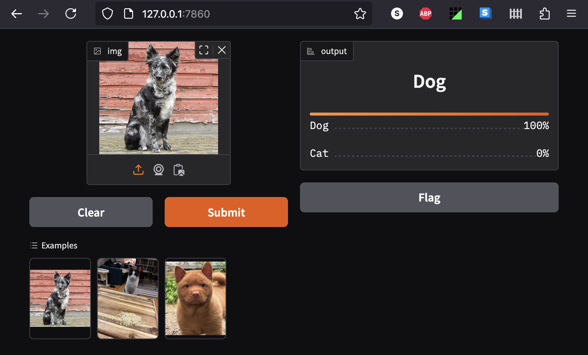

# Working through https://course.fast.ai/, feb 2025, with Recurse study group

[Paul Winkler](https://www.recurse.com/directory/5804-paul-winkler)


# Lesson Notes

## Notes on lessons 1 (Getting Started) and 2 (Production)

### Installing fastbook / fastai on a Macbook Air M1 (2020)

Various warnings about Mac not being supported.

As a starting point, I had:

- Python 3.12 installed via homebrew
- Python 3.13 likewise
- I chose 3.12 for this as there seems to be a general recommendation to use one less
  than latest python for Pytorch et al?

I use [direnv](https://direnv.net/) to manage all my directory-specific environment setup.
You don't have to - you could manually use pyvenv, virtualenv, or whatever you like;
with direnv, I just create this `.envrc` file in the directory where I clone
this repo:

```
layout python python3.12
```

After creating that file and doing the usual `direnv allow` command, a
virtualenv is created for me with the right version of python:

```console

$ vim .envrc
direnv: error /Users/paul/src/practical-deep-learning-fastai/.envrc is blocked. Run `direnv allow` to approve its content

$ direnv allow
direnv: loading ~/src/practical-deep-learning-fastai/.envrc
direnv: export +VIRTUAL_ENV ~PATH

(python-3.12)$ which python
/Users/paul/src/practical-deep-learning-fastai/.direnv/python-3.12/bin/python
```

Now I'm ready to install packages.

First I followed [this blog](https://pnote.eu/notes/pytorch-mac-setup/#mps--metal-support)
which suggested the default install steps for pytorch:

```console
$ pip3 install torch torchvision torchaudio
```

That seemed to work as per the example program:

```pycon
>>> import torch
>>> # Check that MPS is available
>>> if not torch.backends.mps.is_available():
...    if not torch.backends.mps.is_built():
...        print("MPS not available because the current PyTorch install was not "
...              "built with MPS enabled.")
...    else:
...        print("MPS not available because the current MacOS version is not 12.3+ "
...              "and/or you do not have an MPS-enabled device on this machine.")
... else:
...    print("all good")
all good
```

So I tried `pip install fastbook` (which includes fastai) - apparently this reinstalls
different versions of pytorch et al.
Why am I using pip?
Because that's what's used in all the example jupyter notebooks for this course
on Kaggle and Colab, and it works there. I'm comfortable with Pip and didn't feel a need
to go on a tangent into trying different Python installers and getting up to
speed on mamba vs conda et al.
Good news - Pip seems to have worked!

```console

$ pip install fastbook
Collecting fastbook
  Downloading fastbook-0.0.29-py3-none-any.whl.metadata (13 kB)
... [LOTS OF OUTPUT SNIPPED]
ERROR: pip's dependency resolver does not currently take into account all the packages that are installed. This behaviour is the source of the following dependency conflicts.
torchaudio 2.6.0 requires torch==2.6.0, but you have torch 2.5.1 which is incompatible.
Successfully installed aiohappyeyeballs-2.4.6 aiohttp-3.11.12 aiosignal-1.3.2 annotated-types-0.7.0 anyio-4.8.0 appnope-0.1.4 argon2-cffi-23.1.0 argon2-cffi-bindings-21.2.0 arrow-1.3.0 asttokens-3.0.0 async-lru-2.0.4 attrs-25.1.0 babel-2.17.0 beautifulsoup4-4.13.3 bleach-6.2.0 blis-1.2.0 catalogue-2.0.10 certifi-2025.1.31 cffi-1.17.1 charset-normalizer-3.4.1 click-8.1.8 cloudpathlib-0.20.0 comm-0.2.2 confection-0.1.5 contourpy-1.3.1 cycler-0.12.1 cymem-2.0.11 datasets-3.3.1 debugpy-1.8.12 decorator-5.1.1 defusedxml-0.7.1 dill-0.3.8 executing-2.2.0 fastai-2.7.18 fastbook-0.0.29 fastcore-1.7.29 fastdownload-0.0.7 fastjsonschema-2.21.1 fastprogress-1.0.3 fonttools-4.56.0 fqdn-1.5.1 frozenlist-1.5.0 fsspec-2024.12.0 graphviz-0.20.3 h11-0.14.0 httpcore-1.0.7 httpx-0.28.1 huggingface-hub-0.28.1 idna-3.10 ipykernel-6.29.5 ipython-8.32.0 ipython-genutils-0.2.0 ipywidgets-7.8.5 isoduration-20.11.0 jedi-0.19.2 joblib-1.4.2 json5-0.10.0 jsonpointer-3.0.0 jsonschema-4.23.0 jsonschema-specifications-2024.10.1 jupyter-client-8.6.3 jupyter-core-5.7.2 jupyter-events-0.12.0 jupyter-lsp-2.2.5 jupyter-server-2.15.0 jupyter-server-terminals-0.5.3 jupyterlab-4.3.5 jupyterlab-pygments-0.3.0 jupyterlab-server-2.27.3 jupyterlab-widgets-1.1.11 kiwisolver-1.4.8 langcodes-3.5.0 language-data-1.3.0 marisa-trie-1.2.1 markdown-it-py-3.0.0 matplotlib-3.10.0 matplotlib-inline-0.1.7 mdurl-0.1.2 mistune-3.1.1 multidict-6.1.0 multiprocess-0.70.16 murmurhash-1.0.12 nbclient-0.10.2 nbconvert-7.16.6 nbformat-5.10.4 nest-asyncio-1.6.0 notebook-7.3.2 notebook-shim-0.2.4 overrides-7.7.0 packaging-24.2 pandas-2.2.3 pandocfilters-1.5.1 parso-0.8.4 pexpect-4.9.0 platformdirs-4.3.6 preshed-3.0.9 prometheus-client-0.21.1 prompt_toolkit-3.0.50 propcache-0.2.1 psutil-7.0.0 ptyprocess-0.7.0 pure-eval-0.2.3 pyarrow-19.0.0 pycparser-2.22 pydantic-2.10.6 pydantic-core-2.27.2 pygments-2.19.1 pyparsing-3.2.1 python-dateutil-2.9.0.post0 python-json-logger-3.2.1 pytz-2025.1 pyyaml-6.0.2 pyzmq-26.2.1 referencing-0.36.2 regex-2024.11.6 requests-2.32.3 rfc3339-validator-0.1.4 rfc3986-validator-0.1.1 rich-13.9.4 rpds-py-0.22.3 safetensors-0.5.2 scikit-learn-1.6.1 scipy-1.15.2 send2trash-1.8.3 sentencepiece-0.2.0 shellingham-1.5.4 six-1.17.0 smart-open-7.1.0 sniffio-1.3.1 soupsieve-2.6 spacy-3.8.4 spacy-legacy-3.0.12 spacy-loggers-1.0.5 srsly-2.5.1 stack_data-0.6.3 terminado-0.18.1 thinc-8.3.4 threadpoolctl-3.5.0 tinycss2-1.4.0 tokenizers-0.21.0 torch-2.5.1 torchvision-0.20.1 tornado-6.4.2 tqdm-4.67.1 traitlets-5.14.3 transformers-4.49.0 typer-0.15.1 types-python-dateutil-2.9.0.20241206 tzdata-2025.1 uri-template-1.3.0 urllib3-2.3.0 wasabi-1.1.3 wcwidth-0.2.13 weasel-0.4.1 webcolors-24.11.1 webencodings-0.5.1 websocket-client-1.8.0 widgetsnbextension-3.6.10 wrapt-1.17.2 xxhash-3.5.0 yarl-1.18.3
$

```

Apparently the warning about torchaudio version mismatch is OK enough? We'll see.


```pyshell

>>> import torch
>>> if not torch.backends.mps.is_available():
...     if not torch.backends.mps.is_built():
...         print("MPS not available because the current PyTorch install was not "
...               "built with MPS enabled.")
...     else:
...         print("MPS not available because the current MacOS version is not 12.3+ "
...               "and/or you do not have an MPS-enabled device on this machine.")
... else:
...     print("all ok")
...
all ok
>>> import fastbook
Matplotlib is building the font cache; this may take a moment.
>>>
```

### Running the notebook locally

I tried running `jupyter notebook` and navigating to chapter 2.
It worked! But cells wouldn't run. I noticed this logged in the terminal:

```console
[W 2025-02-18 16:39:30.338 ServerApp] Notebook book/01_intro.ipynb is not trusted
```

Jupyter will need to be told it's OK to trust this notebook, and then we can
run it:

```console
$ jupyter trust book/02_production.ipynb
Signing notebook: book/02_production.ipynb
```

Then we can run it again:

```console
$ juypter notebook
```

Once that's done, any notebook sections in the `book/` or `lessons/` subdirectory
_that are intended to run locally_ should work.
I'll update my copies of the notebooks as I go through the course,
to ensure they work for me.

For example, I made some changes to my fork of the [chapter 2 notebook](book/02_production.ipynb)
to ensure I can resume locally with the
exported bear classification pickle (included in this repo) without having to
re-do the first half that's intended to be run on Colab with a GPU.  (I may
later try running _everything_ locally and see how long it takes to train on
the M1's GPU, which only has 8GB unified memory for both CPU and GPU!)

That done, it worked! Like so:

```python

from fastbook import *
from fastai.vision.widgets import *

path = Path()
exported_bear_model_path = path/'bear-export.pkl'
learn_inf = load_learner(exported_bear_model_path)

test_image_path = Path() / "images"
test_image_path = test_image_path / "grizzly.jpg"

learn_inf.predict(test_image_path')
```
```
('grizzly', tensor(1), tensor([2.7573e-04, 9.9949e-01, 2.3265e-04]))
```

### Meta note: Probably not going to run / update book notebooks anymore

I found that while it's worth reading the book chapter notebooks, because they have
background and info that isn't in the video lessons or kaggle notebooks - it's
not worth the trouble to actually run them.

This is largely because most book
chapters have not been updated since april 2022 - whereas the kaggle notebooks
are much more up to date (2024), and even the video lessons from 2022 are at least a few
months later than the book notebooks.

Result: the book notebooks have too many obsolete commands and API calls that need fixing,
outdated recommendations for deployment, etc. But the background info is still great.

This seems to jibe with the experience of other people in the study group.

I'll keep an eye out for whether this is still true in later lessons - the
production deployment chapter is very prone to this problem as there's a
million ways to run jupyter notebooks and deploy apps from them.


### Enabling Voila (can skip this, it's a side quest)

The book gives an obsolete command:

```
!jupyter serverextension enable --sys-prefix voila
```

That should be:

```
!jupyter server extension enable --sys-prefix voila
```

However, I ended up skipping Voila because in the video lesson,
that seems to have been dropped in favor of Gradio.

### Exporting with nbdev

This wasn't mentioned:

```console
$ pip install nbdev
```

The video code at 49:14 is wrong, this works:

```python
import nbdev.export
nbdev.export.nb_export("02_app.ipynb", name="deployable_is_it_a_cat")
```

That done, the exported file works when run locally:

```console
$ cd lessons/
$ python deployable_is_it_a_cat.py
* Running on local URL:  http://127.0.0.1:7861

To create a public link, set `share=True` in `launch()`.
```
I can click that URL and upload cats and dogs and get an answer:




### Deploying to Huggingface

I made a separate repo to deploy from as that seemed the path of least
resistance.
But, that means manually copying the exported app to it, renaming it `app.py`,
copying needed model files, maintaining a `requirements.txt`, etc.
None of that hard, but tedious and I'm likely to forget if I ever revisit this!


### HUGGINGFACE WARNING: need to enable git lfs BEFORE adding a large blob


Don't just dump a big pickle file into your repo!
Other folks ran into this issue:

```
You will also need to install Git LFS, which will be used to handle large files
such as images and model weights.
```

We're going to need to install git-lfs first. On mac:

```
brew install git-lfs
```

Then we can enable it:

```
git lfs install
git lfs track '*.pkl'
git lfs track '*.jpg'
git lfs track '*.png'
git lfs track '*.jpeg'
```

Need to do that BEFORE adding big files, or else you get:

```console
$ git push
Username for 'https://huggingface.co': slinkp@gmail.com
Password for 'https://slinkp@gmail.com@huggingface.co':
Enumerating objects: 14, done.
Counting objects: 100% (14/14), done.
Delta compression using up to 8 threads
Compressing objects: 100% (12/12), done.
Writing objects: 100% (13/13), 41.82 MiB | 1.93 MiB/s, done.
Total 13 (delta 2), reused 0 (delta 0), pack-reused 0
remote: -------------------------------------------------------------------------
remote: Your push was rejected because it contains files larger than 10 MiB.
remote: Please use https://git-lfs.github.com/ to store large files.
remote: See also: https://hf.co/docs/hub/repositories-getting-started#terminal
remote:
remote: Offending files:
remote:   - 02_is_cat_model.pkl (ref: refs/heads/main)
remote: -------------------------------------------------------------------------
To https://huggingface.co/spaces/slinkp/is_it_a_cat
```

If you create the repo on huggingface spaces that may work out of the box?
I think I hit this because I created my own repo, then added my huggingface
space as a remote.

Removing the file, rebasing the remove onto the commit that added it so it
never existed, then re-adding in a new commit AFTER doing `git lfs install`
seems to have worked.

### My first working app on Huggingface 

This is the dog / cat classifier example from lesson 2:

https://huggingface.co/spaces/slinkp/is_it_a_cat

Deploying it could use automating - I currently manually copy
`lessons/deployable_is_it_a_cat.py`
into a separate repo, rename it `app.py`, add the pickle files it needs, and
push that repo to huggingface.

I built a simple web app against its API (well, cursor did a lot of it for me)
and deployed it here:

https://slinkp.com/static/is_it_a_cat.html


#### Web app iteration: five-way classifier

I updated my [lesson 1 classifer](lessons/01_is_it_a_bird.ipynb): it's now a five-way classifier for bird,
kitten, puppy, guitar, bass. With some data cleaning as per lesson 2.
And I updated https://huggingface.co/spaces/slinkp/is_it_a_cat to support both
as a tabbed UI.

And I've updated the [web app](https://slinkp.com/static/is_it_a_cat.html) to use the 5-way classifier.

TIL that apparently when you expose multiple learners in a huggingface app, it will
conveniently name the endpoints like "/predict", "/predict_1", et al.
Don't know if there's a way to control those.

As noted above, i got training working locally on the mac - the current version
of `is_it_a_bird.ipynb` was run locally.
Note that I had to `export PYTORCH_ENABLE_MPS_FALLBACK=1` before running
`jupyter notebook` to do that;
not sure if the trainer would work, but
`batch_tfms=aug_transforms()` does not so I didn't get that far.
I'm curious if it would work without `aug_transforms`; that didn't seem to
improve my accuracy at all anyway.

### Questions to follow up

- [ ] Is there a safer way to export/load than pickle?
- [ ] Can I control the name of the endpoint in a huggingface app?
- [ ] Can I name my huggingface app something other than `app.py`?
- [ ] Is it possible to build my dataloaders *without* GPU and then fine-tune
      *with* GPU? So I can `DataBlock(...batch_tfms=aug_transforms())`
      but still get fast training.

## Lesson 3: Neural Net Foundations


Can pretty much start at [12:11](https://www.youtube.com/watch?v=hBBOjCiFcuo&t=731s)

I'm skipping both paperspace and jupyterlab -
already got kaggle and colab and local notebooks, i don't need 5 ways of doing
the same thing! He mentions that jupyterlab is especially good for folks not
comfortable with terminal. I'm a terminal guy.

Good idea: Use one notebook for training, another for building an app / deploying.

TODO:

- [x] read [which image models are best](https://www.kaggle.com/code/jhoward/which-image-models-are-best/)
- [x] 18:00 try `convnext*` models for my classifier; faster and better than
      `resnet*`, per that notebook. He said he chose `"convnext_base_in22ft1k"`
      but in the video we see `"convnext_tiny_in22k"`
- [ ] Q: 18:32 what is `vision_learner(...).to_fp16()`?
- [ ] 21:47 introspect `learn.model`

Using `@interact` to find a function that fits:
[27:20](https://www.youtube.com/watch?v=hBBOjCiFcuo&t=1640s)

Then use mean squared error (MSE) to quantify that. That's a "loss function"
for this example.

Automating improvement of loss function:
you could try parameters in a loop. But that's slow.
Better: calculate the derivative!
That's a function that tells you how to change the parameters to make the loss better.

- [ ] TODO: learn about derivatives. Eg khan academy!

Pytorch can do it for you!

What's a tensor? A: Everything in pytorch is a tensor. Basically an N-dimensional array.

#### Gradient descent!

This basically just optimizes function parameters to minimize the loss
function by following the derivative in a loop.
Calculate the gradient, update the parameters, see if the loss decreases,
repeat.

Walking through an example at [33:39](https://www.youtube.com/watch?v=hBBOjCiFcuo&t=2019s)

### RELU + Gradient Descent = Literally Anything

43:18 - 49:00
Mind blown.
Very easy to understand example:
I finally understand why combining a lot of `max(0, m * x + b)` can approximate any function.
That's RELU (rectified linear).


### How to choose a model

[49:21](https://www.youtube.com/watch?v=hBBOjCiFcuo&t=2961s)

General approach:

Start with the smallest/fastest available model (eg resnet18 for image
classification). Iterate on *other* stuff (data cleaning, etc) until happy.

**Common Beginner mistake**: trying bigger models before you've done that!

Only then consider bigger models.
If possible look at something like the benchmark graphs in
https://www.kaggle.com/code/jhoward/which-image-models-are-best/
... left is faster, up is more accurate.

Then ask "do i need it faster? do i need more accuracy?"
Pick something that has the target performance you want and try it!

**Common industry mistake**: wait too long to train a model at all.
Train something on day 1 with whatever data you can get your hands on.

You might find you get good results with little effort and none of your fancy
ideas are needed.  OR you might find you get no accuracy at all and your
project is impossible.

[matrix multiplication](https://www.youtube.com/watch?v=hBBOjCiFcuo&t=3614s)

- [ ] https://matrixmultiplication.xyz/ - matrix multiplication visualizer -
      "this is all the linear algebra you need for deep learning"
      - it allows you to do a whole lot of RELU functions in one go
      - except for the "set negative to zero" part
- [ ] From the chat re lesson 3: [video on back propagation
      math](https://www.youtube.com/watch?v=Ilg3gGewQ5U) (12 min)


Glossed over in the "deep learning in excel" demo:
WHY do we have a column of all ones?

